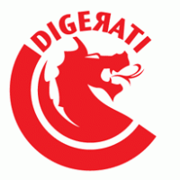

#  &middot; Champak Jogo Disk Archive
### Every Jogo Disk cover CD, preserved in full.

<p align="center">
  
  
  
</p>

The **Jogo Disk** was a bonus CD bundled with **Champak**, India's beloved fortnightly
children's magazine (Delhi Press), produced by **Digerati** from the mid-2000s to the early
2010s. Each disc packed shareware and embeddable **Flash games** that ran straight off the CD,
together with little extras — wallpapers, paint tools, screensavers.

This project preserves **every volume that survives publicly** — re-hosted as GitHub Release
assets so the games stay downloadable forever, no account, no archive.org speed.

---

[](https://the-lust.github.io/Digerati/)
[](https://github.com/the-lust/Digerati/releases)
[](https://github.com/the-lust/Digerati/releases)
[](#)
[](LICENSE) |

> ### 🌐 Browse online: [the-lust.github.io/Digerati](https://the-lust.github.io/Digerati/)
> Filter **98 volumes** by number, letter series, real disc image or damage; search all
> **38,489 games**; preview cover scans; grab `.games.7z` / `.iso.7z` with one click.

---

## What's inside

Every volume is preserved twice:

| Asset | What it is |
|---|---|
| `Vol_XXX.games.7z` | Per-game compression (LZMA2 max, non-solid) — each game is an independently extractable entry, so a single game can be pulled without the whole disc. |
| `Vol_XXX.iso.7z` | The **real disc image** (`.iso`) super-compressed (solid LZMA2 max). For the 24 volumes with no surviving ISO, this is a whole-disc solid archive of the extracted payload instead. |

All archives are attached as GitHub **Release assets** (one release `vol-XXX` per volume).

## Archive overview *(August 2026)*

| | |
|---|---|
| Volumes | **98** (Vol 11–149 + letter series A-4 → M-12) |
| Files | **38,489** (~10.2 GB raw) |
| Release assets | **196 = 17.4 GB** compressed |
| Real disc images | **70** SHA-1 verified (`iso.7z`) |
| Disc cover scans | **52** (`Vol_XXX_cover.jpg` on each release) |
| Sources | ~29 GB ZIP/ISO media, redundancy removed |

Every download is **SHA-1 verified** against archive.org metadata before re-publishing; exact
hashes live in `catalog/source_manifest.csv` and `catalog/vol_*.json`.

## Playing the games

Most games are `.swf` — run them in **[Ruffle](https://ruffle.rs)** (free, in-browser Flash
emulator). Some discs ship `.exe` extras (Click and Paint, Magic Blackboard, wallpapers
installer) that run on Windows or via Wine; `.dcr` Shockwave titles have no maintained
emulator.

## Where it all came from

- ZIP archive (94 vols): [`champak-jogo-disk-archive`](https://archive.org/details/champak-jogo-disk-archive)
- ISO collection (73 vols): [`jogo-disk-collection`](https://archive.org/details/jogo-disk-collection)
- Gap volumes `48, 77, 124` + `107`: individual archive.org items
- Community mirror by u/ReasonablyIntelligent (Google Drive — same files)
- Original reddit thread: ["Made some digital versions of Champak Jogo Disks"](https://www.reddit.com/r/IndianGaming/comments/ldtf6p/)

## Build

```bash
# one volume
scripts/process-volume.ps1 -Vol 112

# everything
scripts/run-all.ps1
```

Pipeline: download → SHA-1 verify → extract → compress per-game + solid disc archives →
upload to release `vol-XXX` → wipe local copy.

## Catalog

- `catalog/vol_*.json` — per-volume metadata (file counts, sizes, source URLs, hashes)
- `catalog/source_manifest.csv` — canonical source → SHA-1 map
- `catalog/games.json` — full per-game index (names + sizes), used by the web archive
- `catalog/process.log`, `catalog/iso_process.log` — processing logs

## Website

`docs/` is a static GitHub Pages site ([link](https://the-lust.github.io/Digerati/)) built from
the catalog — pure HTML/CSS/JS, no build step. The game index is generated by
`scripts/build-games-index.ps1` (HTTP-range ZIP central-directory reads — no bulk downloads).

```
scripts/       pipeline + site data scripts
catalog/       per-volume metadata, manifests, logs, game index
docs/          GitHub Pages site (view online)
```

---

<p align="center"><em>Preserved for the generation of kids who grew up on Champak.
Logos belong to their respective owners.</em></p>